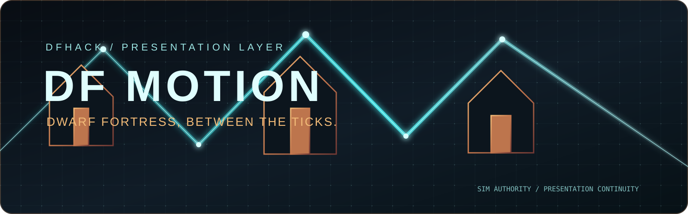

# DF Motion

  <picture>
    <source media="(prefers-color-scheme: dark)" srcset="assets/readme/df-motion-hero-dark.svg">
    <source media="(prefers-color-scheme: light)" srcset="assets/readme/df-motion-hero-light.svg">
    
  </picture>

  <strong>Dwarf Fortress, between the ticks.</strong> 
  A high-refresh presentation layer for a simulation that never gives up its authority.

  
  
  

DF Motion is a development fork of [DF Smooth Movement by notliad](https://github.com/notliad/df-smooth-movement). It makes movement feel continuous between Dwarf Fortress simulation updates while keeping the simulation, entity state, and game decisions authoritative. The command and plugin name remain `smooth-movement` for compatibility.

The north star is simple: **the world should feel alive between the ticks**. A dwarf crosses a doorway with a clean arc. A wagon does not judder across a 240 Hz display. The camera glides without leaving SDL state behind. A pause is still a pause. A game decision is still made by Dwarf Fortress.

## The feeling

DF Motion is a presentation layer, not a second simulation.

    Dwarf Fortress simulation
              │ authoritative snapshots
              ▼
          DF Motion
       ┌──────┼──────┐
       ▼      ▼      ▼
     time   indexed  SDL-safe
   easing   lookup   painting
       └──────┼──────┘
              ▼
        high-refresh display

The plugin observes state that DFHack exposes and paints a temporary in-between position. When the next authoritative state arrives, the presentation catches up. If a unit teleports, disappears, pauses, changes policy, or falls behind, the manager gives authority back to the game instead of inventing a story.

That boundary is the magic: more life in the spaces between decisions, with no hidden rules competing with Dwarf Fortress.

## What moves

- Creatures and multi-tile creature fragments
- Hauled raw materials and carried-object proxies
- Vehicles
- Mirrored/resting creature fragments
- Native follow and optional free-camera motion
- Facing direction and sprite flipping

The implementation preserves exact movement IDs, fragment ownership, companion matching, endpoint geometry, and the existing plugin command surface.

## High-refresh foundation

The original frame-counted watchdog could expire at different wall-clock times as refresh rate changed. DF Motion uses a 2,000 ms elapsed-time watchdog with a monotonic clock and retains the existing 32-bit millisecond rollover contract.

That gives 30, 60, 120, 144, 165, 240, and 360 Hz the same timeout meaning. Duplicate timestamps are handled safely; rollover, stale buffers, partial landings, additional scroll hints, and recovery are covered by tests.

The result is a better temporal foundation for every movement consumer. It does not claim that a game running at 120 simulation FPS will produce 240 real presents/s; the display, renderer, GPU, and fortress workload still decide that.

## Install the verified Windows candidate

This repository carries the selected Windows candidate so the binary and its source history can be checked together.

1. Close Dwarf Fortress.
2. Back up the existing `smooth-movement.plug.dll`.
3. Copy `release/df-motion-pre-live-041de61/hack/plugins/smooth-movement.plug.dll` to your DFHack `hack/plugins` directory.
4. Start Dwarf Fortress through DFHack.
5. In the DFHack console, run:

    load smooth-movement
    enable smooth-movement

The release artifact is built for **DFHack 53.16-r1.1** and the SDL 2D renderer. Keep a copy of the prior DLL so a comparison can be reversed without touching a save.

### Artifact identity

| Artifact | SHA-256 |
| --- | --- |
| `smooth-movement.plug.dll` | `43850CC6C4557BAB82E05C1471181B7D4B1F92F206F78ACBF315865864A534EE` |

The hash is also recorded in [`release/df-motion-pre-live-041de61/SHA256SUMS.txt`](release/df-motion-pre-live-041de61/SHA256SUMS.txt).

The committed release folder is the verified Windows candidate. CI publishes the Linux plugin (.plug.so) and a freshly built Windows plugin (.plug.dll) as separate run artifacts.

## Commands

    smooth-movement             # show plugin status
    disable smooth-movement     # disable the plugin
    smooth-movement all on      # enable flip, linear and hauled
    smooth-movement all off     # disable flip, linear and hauled
    smooth-movement flip on     # flip sprites to face travel
    smooth-movement camera on   # enable the optional free camera
    smooth-movement linear on   # use linear easing with adaptive 150–500 ms tweens
    smooth-movement hauled on   # show carried boulder, bar and wood icons
    smooth-movement stats on    # collect render-hook timing
    smooth-movement stats       # print timing statistics

The `all` switch intentionally leaves the optional free camera and stats mode alone. Every setting can be changed while playing; each new movement captures the policy that was active when it began.

## North-star pillars

### Continuity

Motion is sampled from authoritative endpoints and rendered with elapsed time. New motion starts at the predecessor's rendered position when that predecessor is still valid. An expired eased predecessor cannot teach a new linear duration.

### Immediacy

The manager avoids work that cannot affect the current viewport. Active movement is indexed by layer and tile, and proxy collection reserves a measured capacity hint after candidate tiles are sorted and deduplicated.

### Composure

The renderer restores incoming SDL clip, color, and viewport origin across normal completion and tested early returns. Camera painting cannot leak its clip state into later DF rendering.

### Honesty

Offline fixtures, native builds, and static import checks are named for what they prove. They are not presented as game FPS, sustained 240 presents/s, input latency, or player-perception proof.

## What is retained

The consolidated branch retains this lineage:

| Commit | Role |
| --- | --- |
| `5a4c448440d732097ace2a0cb415d8762c0a0d30` | Frozen indexed baseline with exact anchors |
| `4c954b9` | SDL renderer-state restoration |
| `38a2d43` | Movement-owned interpolation policy |
| `9834475` | Presentation-phase and allocation attribution tooling |
| `041de61` | Proxy reservation after candidate deduplication |
| `d87d03e`, `381fb84`, `48020d0` | Earlier high-refresh and identity-continuity history |

The indexing architecture is an adaptation of [upstream PR #22](https://github.com/notliad/df-smooth-movement/pull/22), authored by Tom Van Eyck (`vaneyckt7`, commit `0802bf...`). [Upstream PR #24](https://github.com/notliad/df-smooth-movement/pull/24), commit `81c19e...`, informed a snapshot and scratch-reuse investigation. Both are credited as upstream work; neither implies endorsement of this fork.

## Offline performance evidence

The final comparison is `5a4c448` → `041de61`, using six clean trials, 24 warmup frames, and 96 measured frames per fixture/engine/trial. It measures complete manager and collector work on a recorded i9-12900K Windows workstation with native `/O2 /MD` and assertions enabled.

These are **synthetic CPU fixture timings in microseconds per complete frame**, not game FPS:

| Fixture | Median baseline → final | Change |
| --- | ---: | ---: |
| Dense 200, one viewport | 1,339.75 → 1,006.50 | −24.88% |
| Frequent changes, one viewport | 1,507.60 → 1,178.80 | −21.80% |
| Dense 200, nine viewports | 12,298.80 → 9,392.10 | −23.63% |
| Frequent changes, nine viewports | 13,772.35 → 10,732.75 | −22.07% |
| Idle, one viewport | 53.80 → 53.80 | 0.00% |
| Paused, nine viewports | 490.15 → 491.55 | +0.29% |

All 36 paired busy medians improved. Busy nine-viewport peak requested memory changed from 8,701,790 to 8,832,038 bytes (+130,248); retained requested bytes stayed unchanged. The measured reserve avoids repeated vector growth and nested proxy copies without changing ordering or matching.

Read the full tables, tails, allocation semantics, and raw-data recomputation in [`docs/VALIDATION.md`](docs/VALIDATION.md) and [`docs/ROADMAP.md`](docs/ROADMAP.md).

## Deliberately rejected experiments

DF Motion keeps a small, explainable core.

- Exact snapshot caching plus scratch reuse passed behavior checks, but its predeclared busy-repeat gate stayed ambiguous: frequent-nine medians worsened in 7/12 trials and p95 in 8/12.
- Scratch reuse alone passed behavioral checks, yet frequent-nine medians worsened in 4/12 trials and p95 in 5/12; it also retained persistent storage.
- A geometry rewrite passed reachable normal-zoom seams but did not establish a production defect; existing geometry remains the authority.
- Arbitrary capacity multipliers, new easing curves, spring cameras, animated zoom, and UI motion were not justified by the measured proof boundary.

Rejected work remains documented for auditability. A surviving test subset is not relabeled as defect detection.

## Current proof boundary

The verified candidate has:

- Fresh manager, collector, policy, geometry, and SDL offscreen tests
- Native DFHack 53.16-r1.1 build proof with dynamic CRT linkage
- x64, ABI, export, DFHack import, and SDL symbol inspection
- Exact source-to-binary hash binding
- Candidate installation and runtime readback on DF 0.53.16 / DFHack 53.16-r1.1

The current runtime readback is a controlled test save at 2560×1440 windowed, simulation cap 120, graphics cap 240. The candidate loaded with the plugin enabled. A matched control/candidate live A/B, sustained present timing, dense-fortress stress, resize/zoom sweep, and full perceptual acceptance remain open.

Configured caps are settings, not attained measurements. Display timing is recorded as missing when the capture path cannot observe it; it is never presumed.

## Build from source

The CI workflow pins DFHack 53.16-r1.1, builds the Linux test target, cross-builds the Windows plugin through DFHack's release path, hashes both binaries, and uploads them as artifacts.

    cmake -S . -B build -G Ninja -DCMAKE_BUILD_TYPE=Release
    cmake --build build --target smooth-movement-test
    build/smooth-movement-test

For a native plugin build, place the source under DFHack's external plugin tree and use the matching DFHack build environment. The package does not claim to bundle a hermetic Windows toolchain.

## Roadmap to the wow moment

1. Finish the matched control/candidate live A/B on an identical temporary save.
2. Capture present intervals, simulation throughput, and actual 1% lows when the display path exposes them.
3. Port further indexing improvements only while preserving exact multi-tile anchors and movement IDs.
4. Audit fractional-pixel geometry across every reachable zoom and downstream raster path.
5. Give each movement a stable interpolation policy, duration, and phase for its full lifetime.
6. Explore camera and world-effect polish only after the invariant seams stay quiet.

The wow moment is a fortress that feels physically present: crossings land exactly, crowds flow without zippering, the camera settles without a hitch, and a pause never lies.

## Credits and license

Original project: [notliad/df-smooth-movement](https://github.com/notliad/df-smooth-movement). Upstream PR #22 and PR #24 are credited above with their authors and commit identities. DF Motion is distributed under the [MIT License](LICENSE).

## Contributing

Performance claims should include the fixture, trial count, warmup, measured rows, compiler, and whether the number is CPU timing or display timing. Visual changes should include the tested zoom, tile width, viewport, movement class, and a before/after capture when available.

Please keep changes small enough to attribute. Preserve the simulation authority boundary, exact fragment ownership, SDL state restoration, and rollback-safe artifact identity.
